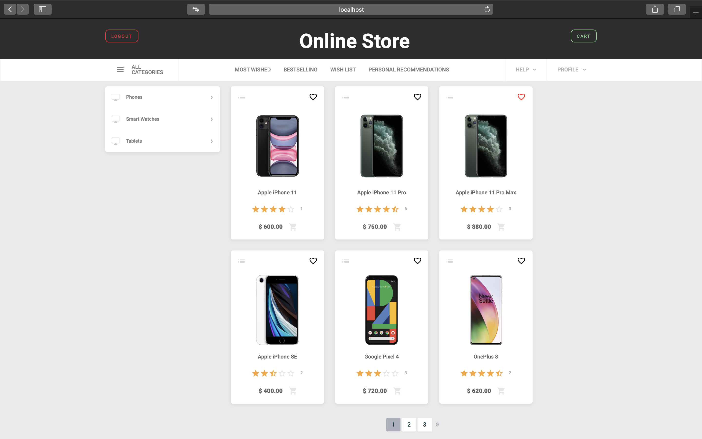

## My final project for Developers.Institute

Online store engine built with Django, Django REST framework, Celery, RabbitMQ, Redis, Falcon, PyTorch, PostgreSQL, Docker.

**Main functions:**

- Braintree integration

- Generating and sending invoices in pdf

- Recommender system built with Redis

- Recommender system built with neural network

  

**Setup:**

- Create .env file in project root  directory:

  ```
  TZ=Asia/Tel_Aviv
  DJANGO_SECRET_KEY=SecretKey
  DJANGO_DEBUG=True
  
  EMAIL_HOST_USER=your@email.com
  EMAIL_HOST_PASSWORD=passwordyour
  
  RABBITMQ_HOST=rabbitmq
  RABBITMQ_DEFAULT_USER=rabbitmq_user
  RABBITMQ_DEFAULT_PASS=rabbitmq_pass
  RABBITMQ_DEFAULT_VHOST=store
  RABBITMQ_DEFAULT_PORT=5672
  
  BRAINTREE_MERCHANT_ID=your_id
  BRAINTREE_PUBLIC_KEY=your_public_key
  BRAINTREE_PRIVATE_KEY=your_private_key
  
  POSTGRES_DB=postgres_db
  POSTGRES_USER=postgres_user
  POSTGRES_PASSWORD=password
  POSTGRES_HOST=database
  POSTGRES_PORT=5432
  ```

- Run commands:

  ```
  docker-compose build
  docker-compose run --rm web sh -c "python manage.py makemigrations"
  docker-compose run --rm web sh -c "python manage.py migrate"
  docker-compose run --rm web sh -c "python manage.py createsuperuser"
  docker-compose run --rm recsys sh -c "python setup.py"
  docker-compose up
  ```

  

**Screenshot:**



